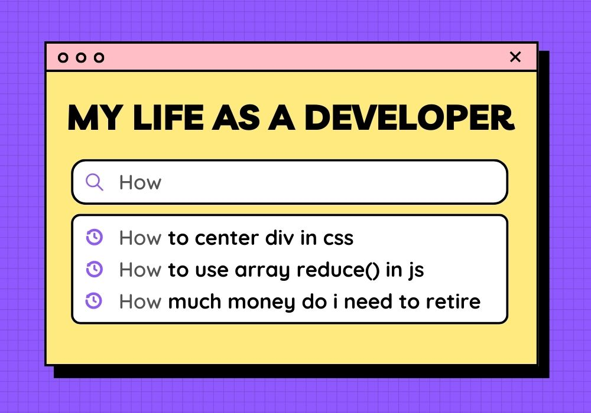

  

## Hi, I'm Pob 👻

### 🚧 Projects I’m currently working on

- ✏️ **Diagram Drawing App**: [[Open the app] ↗](https://react-diagram.netlify.app)  
  ...for more details, please visit the repo: [react-diagram](https://github.com/pobch/react-diagram)

### ❤️ Technologies I love

- Typescript / Javascript  
  ↳ because `(null < 1) === true` is very intuitive 🙃
- React  
  ↳ because dealing with `useEffect()` is soooo much fun 🧨
- CSS  
  ↳ because everything in CSS is `!important` 🚀

### 📫 How to reach me

- [LinkedIn](https://www.linkedin.com/in/pob-ch-b2836baa)
- [Twitter](https://twitter.com/pob_ch)

<!--
**pobch/pobch** is a ✨ _special_ ✨ repository because its `README.md` (this file) appears on your GitHub profile.

Here are some ideas to get you started:

- 🔭 I’m currently working on ...
- 🌱 I’m currently learning ...
- 👯 I’m looking to collaborate on ...
- 🤔 I’m looking for help with ...
- 💬 Ask me about ...
- 📫 How to reach me: ...
- 😄 Pronouns: ...
- ⚡ Fun fact: ...
-->
