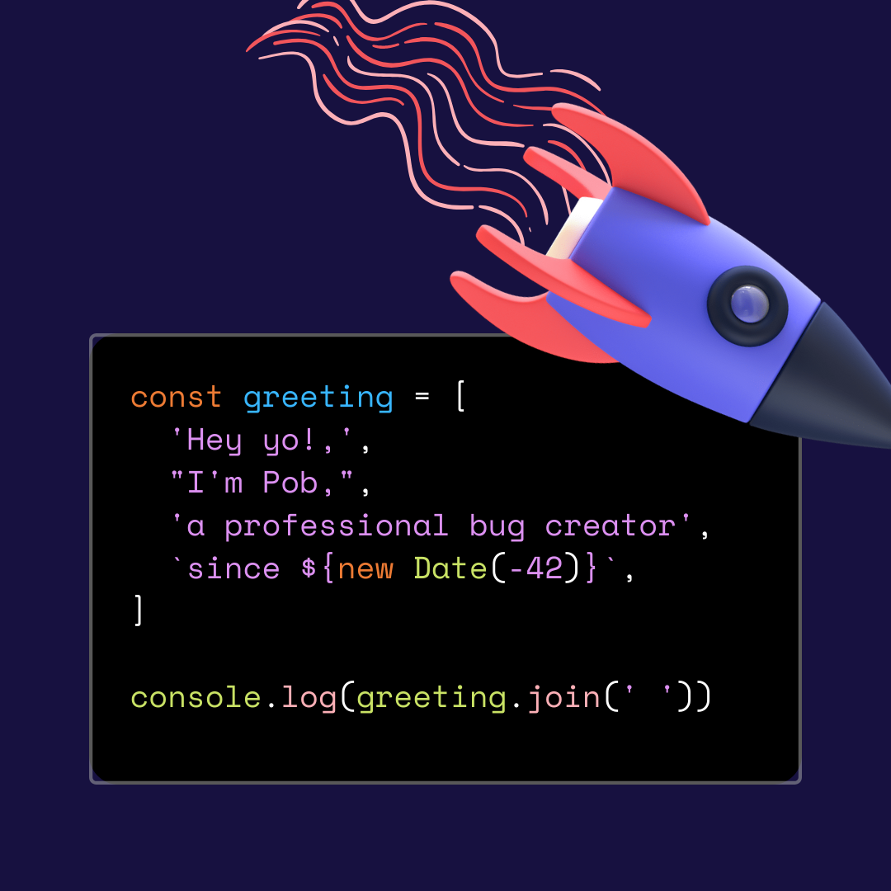

  

### 👻 I’m currently working on ...
- https://react-diagram.netlify.app/

### ❤️ Technologies I love
- Typescript / Javascript
- React
- CSS (because it surprises me everyday 😭)

### 📫 How to reach me
- [LinkedIn](https://www.linkedin.com/in/pob-ch-b2836baa)
- [Twitter](https://twitter.com/pob_ch)

<!--
**pobch/pobch** is a ✨ _special_ ✨ repository because its `README.md` (this file) appears on your GitHub profile.

Here are some ideas to get you started:

- 🔭 I’m currently working on ...
- 🌱 I’m currently learning ...
- 👯 I’m looking to collaborate on ...
- 🤔 I’m looking for help with ...
- 💬 Ask me about ...
- 📫 How to reach me: ...
- 😄 Pronouns: ...
- ⚡ Fun fact: ...
-->
